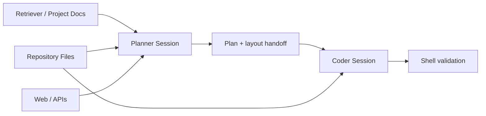

# Advanced Example: Two Agents for Coding

This example shows one practical pattern for using two models together:

- Agent 1 is the planner and layout designer
- Agent 2 is the implementation agent

This is an application-level orchestration pattern built on top of two `AgentSession` instances. The core runtime does not currently ship a dedicated multi-agent coordinator.

## Goal

Build a small feature with a research-plus-implementation workflow where the planner:

- inspects the repository
- retrieves internal guidance
- looks up external references
- proposes the file layout and implementation plan

Then the coder:

- reads the repository
- edits files
- runs validation commands

## Tool split

Planner-focused tools:

- `list_directory`
- `read_file`
- `http_request`
- `web_search`
- `retrieve_documents`

Coder-focused tools:

- `list_directory`
- `read_file`
- `write_file`
- `run_shell_command`

## Architecture flow



## Step 1: prepare shared retrieval knowledge

```python
from agent_manager.memory import HashEmbeddingProvider, InMemoryVectorRetriever, TextChunker

embedder = HashEmbeddingProvider(dimensions=64)
retriever = InMemoryVectorRetriever(embedder.embed)
chunker = TextChunker(chunk_size=400, overlap=60)

retriever.index_document(
    "project-requirements",
    open("requirements.md", "r", encoding="utf-8").read(),
    metadata={"source": "requirements.md", "kind": "project-spec"},
    chunker=chunker,
)
```

## Step 2: build the planner session

The planner is allowed to inspect and research, but not to edit files or run shell commands.

```python
from agent_manager import AgentSession, RuntimeConfig

planner_config = RuntimeConfig.from_dict(
    {
        "provider": {"name": "openai", "model": "gpt-4o-mini", "api_key_env": "OPENAI_API_KEY"},
        "profile": "coding-agent",
        "tool_policy": {
            "denied_tools": ["write_file", "run_shell_command"],
        },
        "system_prompt": (
            "You are the planner. Inspect the repository, check internal requirements, "
            "look up missing information, and return a clear implementation handoff."
        ),
        "context": {
            "pre_call_functions": [
                "collect_recent_messages",
                "summarize_history",
                "inject_retrieval",
                "apply_token_budget",
                "finalize_messages",
            ]
        },
    }
)

planner = AgentSession(config=planner_config, retriever=retriever)
```

## Step 3: build the coder session

The coder is allowed to modify files and run validation commands.

```python
coder_config = RuntimeConfig.from_dict(
    {
        "provider": {"name": "ollama", "model": "llama3.1"},
        "profile": "local-dev",
        "system_prompt": (
            "You are the coding agent. Follow the plan, inspect the code carefully, "
            "make the smallest correct change, and validate the result."
        ),
    }
)

coder = AgentSession(config=coder_config, retriever=retriever)
```

## Step 4: run the planner

The prompt below is designed to make the planner use:

- `list_directory`
- `read_file`
- `web_search`
- `http_request`
- `retrieve_documents`

```python
planner_prompt = """
We need to add a new feature to this repository.

1. Use list_directory to inspect the project layout.
2. Use read_file to inspect the most relevant project files.
3. Use retrieve_documents to pull internal requirements and architecture notes.
4. Use web_search and, when useful, http_request to validate external implementation details.
5. Return:
   - the recommended file layout
   - an implementation checklist
   - any external notes the coder should know
   - a short prompt for the coding agent
"""

plan_result = planner.run(planner_prompt, task_id="two-agent-planning")
print(plan_result.output_text)
```

## Step 5: hand off to the coder

The coder prompt is designed to make the model use:

- `list_directory`
- `read_file`
- `write_file`
- `run_shell_command`

```python
coder_prompt = f"""
You are implementing the feature described below.

Planner handoff:
{plan_result.output_text}

Now do the work:

1. Use list_directory and read_file to inspect the affected files.
2. Use write_file to make the implementation change.
3. Use run_shell_command to run tests, lint, or a smoke check.
4. Return a concise implementation summary and any follow-up risk.
"""

code_result = coder.run(coder_prompt, task_id="two-agent-coding")
print(code_result.output_text)
```

## Optional: structured handoff between agents

You can make the planner return JSON so the coder receives a stable payload.

```python
handoff_schema = {
    "type": "json_schema",
    "name": "coding_handoff",
    "schema": {
        "type": "object",
        "properties": {
            "summary": {"type": "string"},
            "layout": {
                "type": "array",
                "items": {"type": "string"},
            },
            "steps": {
                "type": "array",
                "items": {"type": "string"},
            },
            "coder_prompt": {"type": "string"},
        },
        "required": ["summary", "layout", "steps", "coder_prompt"],
    },
    "strict": True,
}

plan_result = planner.run(
    planner_prompt,
    task_id="two-agent-planning-json",
    structured_output=handoff_schema,
)
```

## Why this pattern works well

- the planner can use external and internal context without editing code
- the coder gets a tighter, more implementation-focused context window
- different providers can be used for planning vs coding
- checkpoints keep the planning and coding threads resumable

## Testing this pattern

Start with a safe smoke test:

1. run the planner with the `echo` provider to confirm the orchestration path
2. switch the planner to a real hosted provider
3. run the coder in a small test repository first
4. review the shell commands and file writes before using it on a production repo

For more provider testing ideas, see [Providers and Connectivity](./providers-and-connectivity.md).
